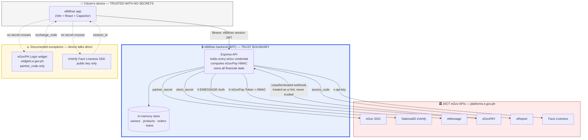
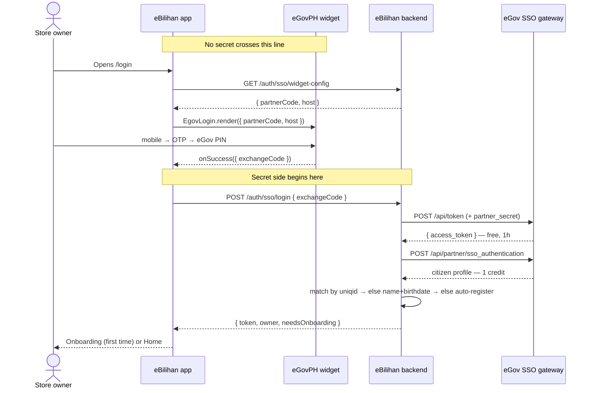
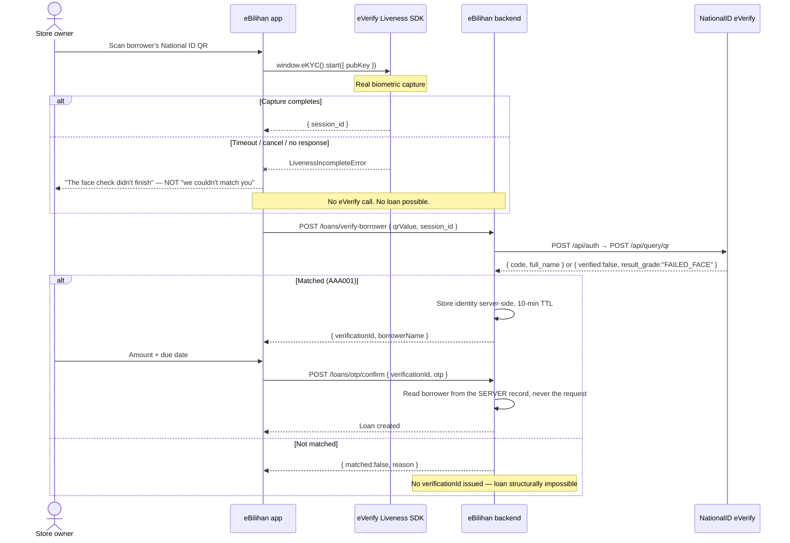

# eBilihan karog

**Where Every Sari-Sari Store Grows Smarter.**

An intelligent POS and digital ledger for Philippine sari-sari store owners — built with
Vite + React + TypeScript, packaged for Android/iOS via Capacitor, and integrating six DICT
eGov APIs: **eGov SSO**, **NationalID eVerify**, **eMessage**, **eGovPAY**, **eReport**, and
**Face Liveness**.

**Setup and run:** [`SETUP.md`](SETUP.md) · **Credentials:** [`eBilihanReference/CREDENTIALS_GUIDE.md`](eBilihanReference/CREDENTIALS_GUIDE.md) · **Deploy:** [`DEPLOY_RUNBOOK.md`](DEPLOY_RUNBOOK.md)

---

## Integration status — what is proven, and what is not

Verified against the **live** DICT API Developer Portal gateway (`platforms.e.gov.ph`), not
against mocks. This table is deliberately conservative: "verified" means we saw the real
response, and anything short of that says so.

| API | Status | Proven live | Not proven, and why |
|---|---|---|---|
| **eGov SSO** | ✅ **Verified end to end** | Widget → `exchange_code` → `POST /api/token` → `POST /api/partner/sso_authentication` → real citizen profile → session issued. Auto-registration and onboarding both exercised. | Production URL registration — needs a DICT administrator (see below) |
| **eReport** | 🟡 **Read verified, write implemented** | Credentials; `integration/token` exchange; `report_types` (14 live categories) and `regions` datasets driving the real form | **Complaint submission deliberately not exercised** — see below |
| **eMessage** | 🟡 **Verified to the API boundary** | Credentials; `POST /messaging/v1/sms/push` → `201 {"data":{"message":"SMS was successfully created."}}` | **Delivery.** The eGov sandbox identity's number receives no SMS by design; proving delivery needs a real handset |
| **NationalID eVerify** | 🟡 **Credentials verified** | `POST /api/auth` authenticates; `POST /api/query/qr/check` reachable and validating input | **No identity match performed** — requires a physical PhilSys card and a camera |
| **Face Liveness** | 🟡 **Session creation verified** | `POST /v1/liveness/session` → real hosted capture URL, correct callback threading | **Capture, result, and the 95.0 threshold** — requires a camera |
| **eGovPAY** | 🔴 **Blocked on a platform gap** | Merchant token authenticates; settlement template, both URLs, items, amount, txnid, currency and expiries **all validate** | **Transaction creation** — the `digest` formula is under-specified. See below |

**Everything testable without a camera has been tested.** The remaining gaps are physical
(a card, a lens, a real phone) or upstream (an under-specified formula), not unwritten code.

### eGovPAY — a documented endpoint that cannot be used from its documentation

Generate Payment requires an HMAC `digest`. The published formula is
`hash_hmac('sha256', "$amount|$txnid", $token)`, which does not specify whether `$token` is
the full `test_`-prefixed header value or the bare key beneath it, nor how `$amount` is
formatted.

What we established, each at the cost of a credit:

| Attempt | Result |
|---|---|
| Bare token in the header | `401 invalid_api_header` |
| `test_`-prefixed header, digest over `"120\|<txnid>"` | `422 {"errors":{"digest":["The digest is not valid."]}}` |
| `test_`-prefixed header, digest over `"120.0000\|<txnid>"` | `422`, same |

The gateway faults **only** `digest` — every other field validates — so the integration is
correct but for one under-specified value. The portal's AI assistant supplied a worked
example whose digest **does not reproduce**: its own stated key and string
(`test_abcdef0123456789abcdef0123456789`, `"120.0000|MYTXNID123"`) yield
`6d727f54a7f935e8…`, not the `2023908815121b6d…` it claimed.

We have stopped guessing rather than spend further credits, and raised it with the
organisers. This is a platform documentation gap, and other teams will hit it.

### eReport — why the write path is deliberately unexercised

`POST /api/integration/submit_complaint` is implemented against the documented contract and
is **not called in testing**. eReport has no sandbox mode, no test flag, no test
`report_type`, and no documented way to withdraw a submission — confirmed with the portal's
own assistant.

Any test submission would therefore file a genuine complaint into a live government triage
queue, consuming a real caseworker's attention, with no way to recall it. **We chose an
unverified endpoint over a false report.** The read path, the datasets, and the form are all
live and real.

---

## Architecture

**The trust boundary is the backend.** No eGov secret ever reaches the device — Vite inlines
every `VITE_` variable into the bundle that ships inside the APK, so anything there is
readable by anyone who unzips it.

**Two documented exceptions**, both of which carry only public values: eGovPH's own login
widget (needs `partner_code`, which its documentation calls safe to expose) and eVerify's
Face Liveness SDK (needs a *public* key). Even `partner_code` is not baked into the bundle —
the app fetches it at runtime from `GET /auth/sso/widget-config`, so rotating a credential is
a server change rather than an app rebuild and store re-release.

### Sign-in — eGov Single Sign Oauth

**No login form, no password, no registration screen** — eGovPH's partner requirements ask
integrated services not to have them, and eBilihan doesn't. Identity fields are read-only.

### Loan issuance — the identity gate

**The borrower's identity never travels through the client.** Verification returns an opaque
`verificationId`; the name, PhilSys number and eGovPH uniqid are read from a server-held
record at loan creation. A client cannot name a borrower eVerify never matched.

**Three failure kinds, kept distinct**, because conflating them harms a real person:
*incomplete* (our camera failed — makes no claim about anyone), *rejected* (eVerify looked and
said no), *unavailable* (upstream error). Telling an owner "we couldn't match this borrower"
when a widget hung accuses a customer of fraud over a UI bug.

---

## Security model

### The ledger is server-authoritative

No client-supplied value determines financial state:

- **Payment status** is written only from eGovPay's Check Transaction response. The app can
  request a re-check (`POST /orders/:id/refresh-payment`, which takes **no body**); it cannot
  assert an outcome. eGovPay's callback is an unauthenticated request from the open internet,
  so it is treated as a hint that triggers a fresh query — its payload is never trusted, and
  that holds whether or not it turns out to be signed.
- **A borrower's identity on a loan** can only originate from a server-held eVerify match.
- **Order totals** are computed from stored product prices, not figures sent by the app.
- **Complainant identity** on an eReport filing is read from the signed-in owner record.

This followed an audit that found the opposite across five write paths — `PATCH /orders/:id`
accepted `{paymentStatus:"paid"}` from any authenticated caller, `PUT /loans/:id` spread the
request body over a verified loan, order totals came from a client `unitPrice`. All are
closed; the standing rule is documented in `eBilihan-app/CLAUDE.md`.

### Credentials

Every secret lives in `eBilihan-app/server/.env` and never leaves the backend. The frontend
`.env` holds only URLs. Seven values are shown once at creation by the portal — see
[`CREDENTIALS_GUIDE.md`](eBilihanReference/CREDENTIALS_GUIDE.md).

Git history was rewritten with `git-filter-repo` to remove a `credentials.txt` that had been
committed early in development, along with a real email address and mobile number in source
and documentation. **Every credential that file ever held must be treated as compromised and
rotated** — a rewrite does not un-leak anything already cloned.

### Credit safety

eGov API calls are metered against a shared, finite balance, and running dry means every
integration returns `429` mid-demo. Two defences:

- **Server-side caching** of eReport reference data (`lib/responseCache.ts`, 24h TTL,
  single-flight). Report types and region lists change about once a year, so N visitors cost
  the same as one. Client-side query options (`EGOV_REFERENCE_QUERY`) stop one browser
  refetching; this stops the *second visitor* costing anything.
- **Rate limiting** on every route that reaches an eGov API (`middleware/rateLimit.ts`) — 20
  billed calls per minute per client, 5 for filing a report, creating a payment, or verifying
  an identity. A brake on runaway spend, not a security control.

Both exist because of a real incident: a 30-second `staleTime` plus TanStack Query's default
`refetchOnWindowFocus` re-fetched two billed endpoints on every return to the tab —
unattended, roughly 2 credits per refocus.

---

## Stack

| | |
|---|---|
| Frontend | React 19, TypeScript, Vite 8, Tailwind CSS v4, Zustand, TanStack Query, Radix UI, Recharts |
| Mobile | Capacitor 8 (Android/iOS), ML Kit barcode scanning, ZXing web fallback |
| Backend | Express 5, TypeScript, `jsonwebtoken`, axios |
| PDF | jsPDF + html2canvas (loan agreements), jsPDF text API (receipts) |
| Auth | eGov SSO → eBilihan-issued JWT sessions |

Two packages, installed independently — `eBilihan-app/` and `eBilihan-app/server/`. Node
20.19+ or 22.12+ (Vite 8's requirement; not enforced by `engines`).

## Features

- **POS** — barcode/QR scanning, cart, checkout, thermal-style PDF receipts
- **Products** — catalogue with stock tracking and low-stock thresholds
- **Wallet & loans** — borrower verification via National ID QR + live face check, OTP-gated
  loan creation, generated PDF agreements
- **Reports** — civic complaints through eReport with live categories and its own PSGC-derived
  location codes
- **eGovPH sign-in** — real SSO; no login, registration, or profile screens of our own

**Lending policy, stated because it is ours and not any API's:** no credit is recorded against
a borrower under 18, and loans at or above `LOAN_LIVENESS_THRESHOLD_PHP` (default ₱1,000)
require the store owner's own Face Liveness check. eVerify will match a minor perfectly
happily; declining is our decision.

## Not a real integration

`server/src/lib/egovchain.ts` is a **hash-chained in-memory stand-in**, clearly labelled as
such. `eBilihanReference/` contains no eGovchain documentation — no base URL, no auth scheme,
nothing. It exists so the wallet has a ledger to read. It is **not** presented as one of the
six integrations and should not be demonstrated as live.

## Deployment

Frontend → Vercel (`vercel.json`). Backend → Render (`render.yaml`, all 22 variables
`sync: false`). Full sequence in [`DEPLOY_RUNBOOK.md`](DEPLOY_RUNBOOK.md).

**Known limitation:** the backend store is in-memory, so a Render cold start signs everyone
out and costs one credit per re-authentication.

## Open questions with DICT

Tracked in [`eBilihanReference/PORTAL_QUESTIONS.md`](eBilihanReference/PORTAL_QUESTIONS.md).
Outstanding and blocking: the eGovPay digest formula (Q2e), per-endpoint credit billing (Q3 —
the assistant restated our own observations rather than answering), and registration of the
production SSO base URL, which requires a DICT administrator.
